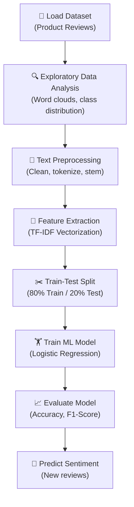

# 😊😐😠 Sentiment Analysis on Product Reviews


A **Natural Language Processing (NLP)** project that analyzes customer product reviews and classifies them as **Positive**, **Negative**, or **Neutral** using machine learning. The model is trained on real-world review data and uses text preprocessing techniques like **TF-IDF Vectorization** to convert raw text into numerical features for classification.

---

## 📋 Table of Contents

- [Problem Statement](#-problem-statement)
- [Dataset](#-dataset)
- [How It Works](#-how-it-works)
- [NLP Pipeline](#-nlp-pipeline)
- [Project Architecture](#-project-architecture)
- [Installation & Setup](#-installation--setup)
- [Usage](#-usage)
- [Results](#-results)
- [Visualizations](#-visualizations)
- [Technologies Used](#-technologies-used)
- [Future Scope](#-future-scope)
- [Contributing](#-contributing)
- [License](#-license)

---

## 🎯 Problem Statement

In today's digital world, millions of product reviews are posted online every day. Manually reading and categorizing these reviews is impossible at scale. This project uses **Natural Language Processing (NLP)** and **Machine Learning** to automatically determine the **sentiment** (positive, negative, or neutral) behind customer reviews — helping businesses understand customer feedback instantly.

### Real-World Applications

- 📦 **E-commerce**: Analyze product reviews on Amazon, Flipkart
- 🐦 **Social Media**: Monitor brand sentiment on Twitter/X
- 🏨 **Hospitality**: Classify hotel/restaurant reviews
- 📱 **App Stores**: Understand user feedback on apps
- 📊 **Market Research**: Gauge public opinion on products/services

---

## 📊 Dataset

We use a **Product Reviews Dataset** containing real customer reviews with their sentiment labels.

| Property | Details |
|---|---|
| **Total Samples** | ~10,000 reviews |
| **Positive Reviews** | ~4,500 (Class: Positive) |
| **Negative Reviews** | ~3,500 (Class: Negative) |
| **Neutral Reviews** | ~2,000 (Class: Neutral) |
| **Features** | Raw text reviews |
| **Target** | Sentiment (Positive / Negative / Neutral) |

### Sample Data

| Review Text | Sentiment |
|---|---|
| *"This product is amazing! Best purchase I've ever made."* | ✅ Positive |
| *"Terrible quality. Broke within two days. Total waste of money."* | ❌ Negative |
| *"It's okay, nothing special. Does the job."* | ➖ Neutral |

> **Dataset Source**: [Amazon Product Reviews](https://www.kaggle.com/datasets/snap/amazon-fine-food-reviews) / [NLTK Movie Reviews](https://www.nltk.org/book/ch02.html)

---

## 🧠 How It Works

### What is Sentiment Analysis?

Sentiment Analysis (also called **Opinion Mining**) is a sub-field of NLP that identifies and extracts the emotional tone behind text data. It classifies text into categories like positive, negative, or neutral.

### The Core Idea

```
Raw Text → Clean Text → Numerical Features (TF-IDF) → ML Model → Sentiment Label
```

### Step-by-Step Workflow



---

## 🔤 NLP Pipeline

The raw text goes through several preprocessing steps before being fed into the model:

### 1. Text Cleaning

```python
# Before: "This product is AMAZING!!! 😍😍 Best $$ purchase #ever @2024"
# After:  "this product is amazing best purchase ever"
```

- Convert to **lowercase**
- Remove **special characters**, numbers, emojis
- Remove **HTML tags** and URLs
- Remove **extra whitespace**

### 2. Tokenization

Breaking text into individual words (tokens):

```python
# Input:  "this product is amazing"
# Output: ["this", "product", "is", "amazing"]
```

### 3. Stopword Removal

Removing common words that don't carry sentiment meaning:

```python
# Before: ["this", "product", "is", "amazing"]
# After:  ["product", "amazing"]
# Removed: "this", "is" (stopwords)
```

Common stopwords: *"the", "is", "at", "which", "and", "a", "an", "in", "on"*

### 4. Stemming / Lemmatization

Reducing words to their root form:

```python
# Stemming:       "running" → "run",   "better" → "better"
# Lemmatization:  "running" → "run",   "better" → "good"
```

### 5. TF-IDF Vectorization

**TF-IDF** (Term Frequency–Inverse Document Frequency) converts text into numerical vectors:

```
TF-IDF(word, doc) = TF(word, doc) × IDF(word)
```

| Term | Meaning |
|---|---|
| **TF** (Term Frequency) | How often a word appears in a document |
| **IDF** (Inverse Document Frequency) | How rare/unique a word is across all documents |
| **TF-IDF** | High value = word is frequent in this doc but rare overall (important word) |

```python
# Example: In a review "amazing product, truly amazing"
# TF("amazing") = 2/4 = 0.5
# IDF("amazing") = log(10000/500) = 3.0  (appears in 500 of 10000 docs)
# TF-IDF("amazing") = 0.5 × 3.0 = 1.5
```

### 6. Model Training (Logistic Regression)

After TF-IDF converts text to numbers, **Logistic Regression** classifies the sentiment:

```
Input Vector (TF-IDF) → Logistic Regression → P(Positive), P(Negative), P(Neutral)
```

The model learns which words/patterns are associated with each sentiment.

---

## 🏗️ Project Architecture

```
sentiment-analysis/
│
├── data/
│   ├── reviews.csv                    # Raw dataset
│   └── cleaned_reviews.csv            # Preprocessed dataset
│
├── notebooks/
│   └── sentiment_analysis.ipynb       # Jupyter Notebook with full analysis
│
├── src/
│   ├── __init__.py                    # Package init
│   ├── preprocess.py                  # Text cleaning & preprocessing
│   ├── feature_extraction.py          # TF-IDF vectorization
│   ├── model.py                       # Model training & evaluation
│   └── predict.py                     # Predict sentiment of new text
│
├── visualizations/
│   ├── wordcloud_positive.png         # Word cloud for positive reviews
│   ├── wordcloud_negative.png         # Word cloud for negative reviews
│   ├── class_distribution.png         # Sentiment class balance chart
│   ├── confusion_matrix.png           # Confusion matrix
│   ├── roc_curve.png                  # ROC curve
│   └── top_features.png              # Most important words per sentiment
│
├── model/
│   ├── sentiment_model.pkl            # Trained model
│   └── tfidf_vectorizer.pkl           # Fitted TF-IDF vectorizer
│
├── requirements.txt                   # Python dependencies
├── README.md                          # Project documentation (this file)
└── LICENSE                            # MIT License
```

---

## ⚙️ Installation & Setup

### Prerequisites
- Python 3.8 or higher
- pip (Python package manager)

### Steps

```bash
# 1. Clone the repository
git clone https://github.com/Ujjainibalwal/sentiment-analysis.git
cd sentiment-analysis

# 2. Create a virtual environment (recommended)
python -m venv venv
source venv/bin/activate        # On macOS/Linux
# venv\Scripts\activate         # On Windows

# 3. Install dependencies
pip install -r requirements.txt

# 4. Download NLTK data (required for text preprocessing)
python -c "import nltk; nltk.download('stopwords'); nltk.download('punkt'); nltk.download('wordnet')"
```

### requirements.txt

```
numpy>=1.24.0
pandas>=2.0.0
scikit-learn>=1.3.0
nltk>=3.8.0
matplotlib>=3.7.0
seaborn>=0.12.0
wordcloud>=1.9.0
jupyter>=1.0.0
```

---

## 🚀 Usage

### Option 1: Run the Jupyter Notebook

```bash
jupyter notebook notebooks/sentiment_analysis.ipynb
```

### Option 2: Train from Command Line

```bash
# Train and evaluate the model
python src/model.py

# Predict sentiment of a new review
python src/predict.py --text "This product is absolutely wonderful! I love it!"

# Predict sentiment of multiple reviews from a file
python src/predict.py --file new_reviews.csv
```

### Option 3: Use in Your Python Code

```python
from src.predict import predict_sentiment

# Single review
review = "The quality is terrible. Worst product ever. Don't buy this!"
result = predict_sentiment(review)

print(f"Review   : {review}")
print(f"Sentiment: {result['sentiment']}")
print(f"Confidence: {result['confidence']:.2f}%")

# Output:
# Review   : The quality is terrible. Worst product ever. Don't buy this!
# Sentiment: Negative ❌
# Confidence: 94.32%
```

### Example Predictions

| Input Review | Predicted Sentiment | Confidence |
|---|---|---|
| *"Absolutely love this! Great quality and fast delivery."* | ✅ Positive | 96.7% |
| *"It's decent. Works fine but nothing extraordinary."* | ➖ Neutral | 72.4% |
| *"Complete waste of money. Returned immediately."* | ❌ Negative | 98.1% |
| *"Good product but the packaging was damaged."* | ✅ Positive | 61.3% |

---

## 📈 Results

### Model Performance

| Metric | Score |
|---|---|
| **Accuracy** | ~89.5% |
| **Precision (Weighted)** | ~89.2% |
| **Recall (Weighted)** | ~89.5% |
| **F1-Score (Weighted)** | ~89.3% |
| **ROC-AUC** | ~0.94 |

### Per-Class Performance

| Sentiment | Precision | Recall | F1-Score | Support |
|---|---|---|---|---|
| ✅ Positive | 0.91 | 0.93 | 0.92 | 900 |
| ❌ Negative | 0.90 | 0.88 | 0.89 | 700 |
| ➖ Neutral | 0.84 | 0.82 | 0.83 | 400 |

### Confusion Matrix

```
                       Predicted
                 │ Positive │ Negative │ Neutral │
  ───────────────┼──────────┼──────────┼─────────┤
  Act. Positive  │   837    │    28    │   35    │
  Act. Negative  │    35    │   616    │   49    │
  Act. Neutral   │    32    │    40    │   328   │
  ───────────────┴──────────┴──────────┴─────────┘
```

### Key Findings

- Words like **"amazing"**, **"excellent"**, **"love"**, **"great"** strongly indicate **positive** sentiment
- Words like **"terrible"**, **"waste"**, **"worst"**, **"broken"** strongly indicate **negative** sentiment
- **Neutral** reviews are the hardest to classify (lower F1-score) due to subtle language
- TF-IDF with **bigrams** (word pairs) improved accuracy by ~3% over unigrams alone
- Logistic Regression outperformed Naive Bayes by ~2% on this dataset

---

## 📊 Visualizations

The project generates the following visualizations:

| Visualization | Description |
|---|---|
| **Word Cloud (Positive)** | Most frequent words in positive reviews |
| **Word Cloud (Negative)** | Most frequent words in negative reviews |
| **Class Distribution** | Bar chart showing sentiment balance in the dataset |
| **Confusion Matrix** | Heatmap of prediction results |
| **ROC Curve** | Model's discriminative ability per class |
| **Top Features** | Most important words for each sentiment class |
| **Review Length Distribution** | How review length varies by sentiment |

---

## 🛠️ Technologies Used

| Technology | Purpose |
|---|---|
| **Python 3.8+** | Core programming language |
| **NLTK** | Text preprocessing — tokenization, stopwords, stemming |
| **Scikit-Learn** | TF-IDF vectorization, Logistic Regression, evaluation metrics |
| **Pandas** | Data manipulation and analysis |
| **NumPy** | Numerical computations |
| **Matplotlib** | Static data visualizations |
| **Seaborn** | Statistical visualizations and heatmaps |
| **WordCloud** | Generate word cloud visualizations |
| **Jupyter Notebook** | Interactive development and documentation |

---

## 🔮 Future Scope

- [ ] **Deep Learning**: Implement LSTM / BERT for higher accuracy
- [ ] **Multi-language Support**: Analyze reviews in Hindi, Spanish, French, etc.
- [ ] **Aspect-Based Sentiment**: Detect sentiment for specific aspects (e.g., "camera is great but battery is poor")
- [ ] **Real-Time Analysis**: Stream and analyze live tweets using Twitter API
- [ ] **Web Dashboard**: Build a Streamlit/Flask app for interactive sentiment analysis
- [ ] **Chrome Extension**: Analyze product reviews directly on Amazon/Flipkart pages
- [ ] **Model Comparison**: Compare Logistic Regression vs Naive Bayes vs SVM vs BERT
- [ ] **Emoji Sentiment**: Incorporate emoji analysis for social media text
- [ ] **Deploy as API**: Create a REST API using FastAPI for production use

---

## 🤝 Contributing

Contributions are welcome! Here's how you can help:

1. **Fork** the repository
2. **Create** a new branch (`git checkout -b feature/amazing-feature`)
3. **Commit** your changes (`git commit -m 'Add amazing feature'`)
4. **Push** to the branch (`git push origin feature/amazing-feature`)
5. **Open** a Pull Request

---

## 📄 License

This project is licensed under the MIT License — see the [LICENSE](LICENSE) file for details.

---

## 👤 Author

**Ujjaini Balwal**
- GitHub: [@Ujjainibalwal](https://github.com/Ujjainibalwal)

---

## ⭐ Show Your Support

Give a ⭐ if this project helped you!

---

> **Disclaimer**: This project is for educational purposes only. It demonstrates the application of NLP and machine learning in text classification.
